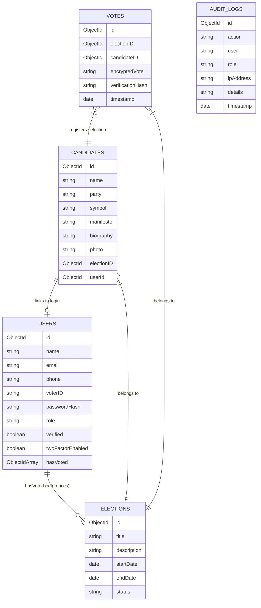
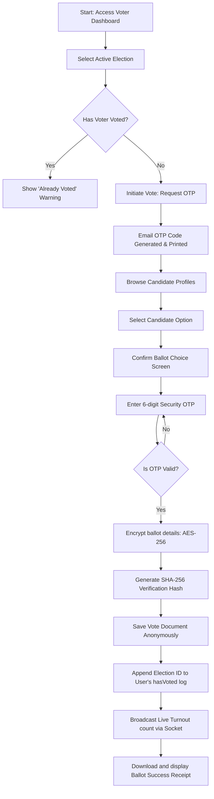

# SecureVote Architecture & System Documentation

This document outlines the system architecture, database schema, REST API design, user flows, and code structure of the SecureVote platform.

---

## 📂 Folder Structure

```
/
├── backend/
│   ├── src/
│   │   ├── config/          # Database & mail configurations
│   │   ├── controllers/     # Route controller handlers
│   │   ├── middleware/      # JWT, Roles, Rate-limiting, Error middleware
│   │   ├── models/          # Mongoose DB schemas
│   │   ├── routes/          # REST route mappings
│   │   ├── utils/           # Crypto, OTP, PDF/Excel generators
│   │   ├── index.ts         # Server entrypoint
│   │   └── seed.ts          # Mock database seeder
│   ├── Dockerfile
│   ├── tsconfig.json
│   └── package.json
├── frontend/
│   ├── src/
│   │   ├── components/      # Reusable UI components
│   │   ├── context/         # Auth, Theme, and Socket contexts
│   │   ├── pages/           # View panels (Landing, Login, Dashboards)
│   │   ├── App.tsx          # Router config
│   │   ├── index.css        # Tailwind styles & scrollbars
│   │   └── main.tsx         # React app bootstrap
│   ├── Dockerfile
│   ├── nginx.conf           # SPA production Nginx config
│   ├── tailwind.config.js
│   └── package.json
├── docker-compose.yml
└── README.md
```

---

## 📊 Database ER Diagram

The following Mermaid diagram outlines the relationships between the MongoDB collections:



---

## 🔄 Voting Process Flowchart

Below is the step-by-step security workflow a voter executes to submit a ballot:



---

## 🔌 API Documentation

### Authentication (`/api/auth`)

* **`POST /register`**: Register a new Voter or Candidate credential.
* **`POST /login`**: Validate login parameters and return JWT credentials. Triggers 2FA challenge if active.
* **`POST /verify-email`**: Confirm 6-digit email confirmation code.
* **`POST /verify-2fa`**: Validate OTP token for 2FA logins.
* **`POST /refresh`**: Refresh expired access tokens with token refresh keys.
* **`POST /logout`**: Audit log user exit sessions.
* **`POST /forgot-password`**: Initiate recovery sequences.
* **`POST /reset-password`**: Supply new credentials with recovery tokens.
* **`POST /2fa`**: (Protected) Toggle Two-Factor Authentication status.

### Elections (`/api/elections`)

* **`GET /`**: Return list of all elections.
* **`GET /:id`**: Fetch details for a specific election.
* **`POST /`**: (Admin/Officer) Create a new election entry.
* **`PUT /:id`**: (Admin/Officer) Update election parameters.
* **`DELETE /:id`**: (Admin) Delete an election and its candidate profiles.
* **`PATCH /:id/status`**: (Admin/Officer) Control state transitions (`upcoming`, `active`, `paused`, `ended`, `published`).

### Candidates (`/api/candidates`)

* **`GET /`**: List candidates. Supports `electionId` and `search` query parameters.
* **`GET /:id`**: Return candidate bio, party details, and symbol.
* **`POST /`**: (Admin/Officer) Create new candidate profile.
* **`PUT /:id`**: (Candidate/Admin) Update biography, symbols, or manifestos.
* **`DELETE /:id`**: (Admin/Officer) Remove candidate.

### Votes (`/api/votes`)

* **`POST /initiate`**: (Voter) Trigger MFA sequence for casting a ballot.
* **`POST /cast`**: (Voter) Submit a verified OTP and cast an anonymous encrypted vote.
* **`GET /verify/:hash`**: (Public) Search and verify a receipt signature matches the live database registry.
* **`GET /results/:id`**: (Authed) Get results tally for an election. Tally decrypts AES ballots. Restricted to admins unless election is closed/published.

### Users (`/api/users`)

* **`GET /profile`**: Fetch current user information.
* **`PUT /profile`**: Edit user profile parameters.
* **`PUT /change-password`**: Update account password.
* **`GET /`**: (Admin/Officer) Fetch all users.
* **`PUT /verification`**: (Admin/Officer) Edit voter validation approval statuses.
* **`DELETE /:id`**: (Admin) Remove a user.

### Admin Tools (`/api/admin`)

* **`GET /stats`**: Fetch counters for totals, participation, and turnout.
* **`POST /import`**: Bulk import voter user rows from raw CSV files.
* **`GET /audit-logs`**: Fetch latest 100 system audit records.
* **`GET /export`**: Export election stats in `pdf`, `excel`, or `csv` formats.
